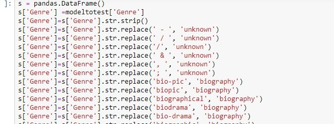

# Movie-Genre-Prediction-Model

## Problem Description:
The problem we have created is for a site by the name of “your_go_movie” (A fictional site) and the aim of this site is to display information of all movies released and will be released, with information being displayed about them like Genre, the directors of the movie, the cast associated with the movie, along with an overview and plot of the movie. When developing this web app, one approach was to manually insert information of all movies. This would definitely ensure that most of the values inserted was indeed error free but a daunting task of entering more than 30000 films is an impractical task. Another solution was to automate the upload of information on the site. 
To automate this process a data sheet of movies containing information about them including genre and such was used. So the company decided to automate the process by reading and uploading the data from this sheet. However a problem which we noticed was that many of the movies had their Genre labeled as “unknown” which definitely caused a problem since many people would view and choose their movie based on Genre. They are trying to cover this problem by labeling these “unknown” data but there is still an abundant amount of movies having genre “unknown”.
 To avoid this turnoff with customers along with dealing with this in future, we were brought in to develop a model using the current directory of data which had movies ranging from 1902 till 2017 to predict the genre of those movies which were labeled as “unknown” and to automate the process of labeling any future movie having Genre as “unknown”. 

## Data Description:
The Data which we are using to make our model is a number of movies which has their information. There are a total of 8 columns and 34892 rows in this data. The columns in this data sheet are
•	Movie Title: name of the movie and this serves as the unique identifier for each row.
•	Release Year: The year the movie was released.
•	Origin/Ethnicity: This column describes the origin or nationality from where this move was made such as “American”, “British” etc.
•	Director: The names of the person who directed this movie.
•	Cast: The People who acted or performed in the movie.
•	Genre: The category or the type of the movie.
•	Plot: A description of the story of the movie.
•	Wiki Page: The Wikipedia page of this Movie from where the movie of this pot was taken.
The Quality of the data itself can only be considered as average due to too many repetitions and mislabeling of data. The first thing which we see is the repetition of data and that can be seen by our unique identifier Titles since each row gives description of a movie so it should be unique and there should be no repetition in the column but however the total number of rows in the excel sheet are:
 

 
However the unique number of values in this title column is:
 

 
This snippet of code shows us that there are indeed quite a number of repetitions in this data. The second part which decreased the quality of data was mislabeling of the data. An example is the genre column where one movie has things mentioned like “bio-pic”, “bio drama”, “biographic” written in Genre column which could have been labeled just as “biography”. This caused multiple problems when encoding our model since the system assumes that these are different categories even though in reality, they are same. The same is in the plot of the movies where words such as “what is” has been written as “what’s” even though they are the same word but again the model perceives them as different words.  
 

 
The above snippet of code shows us that its assuming unique genre is 1990 even though they should be about 1200-1250 at max. The unique column should be the Title column in this but there are repetitions in it as well. There are no constant columns.

## Data Pre-processing:
Now as mentioned above, there were repetition and mislabeled data that was present in the sheet and that had to be corrected. The first thing which we had to remove was the Genre which were the same but were mislabeled differently, so we had to use a replace function to replace them with the general genre that they would be fall in.  

The entire code isn’t displayed but in this code each of those labels which we mislabeled is being replaced with the general genre they fall into. Secondly, data which needed to be manipulated were the words in the plot of the movie. For this code snippet we are using is:

In this snippet, those words which are the same are being replaced with those words which have same meaning to avoid making the system think them as a separate word. The cleaning had to be extensive . To remove the repetition according to the titles the row which was used was:
 

## Model and Evaluation:
Now to create a model we used multiple predictors to create our model. The first one which we tried was the naïve bayes model. The train data was split to test the accuracy with the train data being split in 75% train and 25% test. The count vectorizer is used with ngram range(1,2) and with max_features  9. The code snippet is below:
 
 
 
The above score is after the data was cleaned extensively. 
The second predictor which we had used with this model is Naïve bayes .

The above code gave us a greater accuracy then the simple naïve bayes one. 
Other classifiers were used but their accuracy was either low or they took too long to be processed( e.g Random-forest and gradient Boosting).
The language and program used in this is Python along with Jupyter IDE. The libraries which we used are Sklearn, wordcloud(for visualization), seaborn, matplotlib, pandas and keras. 

## Finding, limitation, deployment and expiry:  
Now after evaluating the data we found a lot of information regarding it 

The above graph displayed in the code shows the number  of movies which were released each year. The most number of movies released were 2013.

 
The above graph shows the number of movies with a specific origin released each year. This graph showed that American origin movie were the most in the market.

 
The graph above shows number of movies released in accordance with the each genre. There are graphs displayed in the code showing before and after the unknown features have been predicted. Both showed that drama was the dominating genre in the market.

 
The graph above shows the number movies each director has released. The unknown directors are those which weren’t labeled (we’re ignoring them for now). With unknown director being the largest and after that Hanna Barber being the second largest.

This is the cast which has appeared in most number of movies with “Tom and Jerry” being at the top, appearing in more than 70 movies.

## Limitations and deployment: 
After completely analyzing the data and making the model, there were many limitations that we faced. first was that mislabeled genre were in a huge amount so finding them was a tedious task . In fact, there were too much for us to find each word so that’s why data wasn’t cleaned properly. The same was with many of the words in the plots of the data. If enough work and manpower was put to replace each different label with the general category they fell into, the accuracy could be increased much. So for future, make sure that any movie which is being inserted, are being labeled with the same general category they fell into and to replace those word in the plots of the movie with the same meaning with a general or same word. 
The model would be deployed through the website and would be run whenever upload any row or movie which has a genre of “unknown” is being uploaded and label it through the plot of the move.
You can specify any date or expiry for the model and will work for a long time but you can say that the model may expire when a movie is being uploaded with a genre that hasn’t been made up till now and wasn’t in the previous data for which the modeling was used so the model should be updated every 8-9 years.
